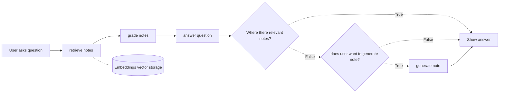

# LORE

Knowledge base management stack. Using:

- Local LLM
- Obsidian
- Raycast

The goal is to augment a local LLM with my own Obsidian notes. If I ask a question that
is not yet covered in my notes, offer the ability to generate a note. This should
be available quickly and without friction, hence the decision to use the Spotlight
replacer, Raycast.

## Implimantation



### Note format

I use a format I have taken to calling atomic notes.

An example may be:

```md
what is postgres.md
---
tags: ['postgres', 'database']
---

PostgreSQL, often abbreviated as Postgres, is a powerful open-source
relational database management system (RDBMS) that allows you to store,
manipulate, and retrieve data efficiently. It's a popular choice for
building scalable and reliable databases, especially in the enterprise
environment.

```

## TODO

- [ ] Link to notes used
- [ ] Actually create Obsidian note
- [ ] Implement Raycast extension
- [ ] Implement structured output
